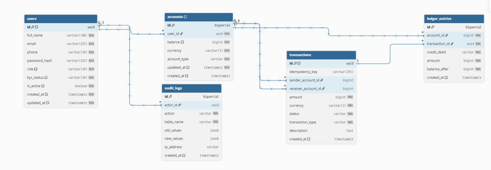

# Apex Bank

A high-performance, scalable, and secure digital banking backend inspired by modern neobanks like Monzo and Razorpay. This project focuses on high throughput, low latency, and ACID-compliant financial transactions.

## 🚀 Overview

Apex Bank is designed to handle the complexities of modern digital finance, featuring a microservices architecture capable of supporting millions of users and high-concurrency transaction environments.

## ✨ Core Features

### Functional
- **Identity & Access:** Secure User Registration with KYC, 2FA, and Role-Based Access Control (Customer, Teller, Admin).
- **Banking Operations:** Multiple account types (Savings, Current, Fixed Deposit) with real-time balance updates.
- **Transactions:** Idempotent fund transfers (NEFT/RTGS/IMPS simulations) and searchable, paginated transaction history.
- **Reporting:** PDF Account Statements and real-time Email/In-app notifications.
- **Security & Control:** Account freeze/unfreeze capabilities, basic fraud detection, and comprehensive Audit Logs.
- **Management:** Centralized Admin Dashboard for system oversight.

### Non-Functional (Performance & Reliability)
- **Performance:** < 500ms P99 latency and 10,000 Transactions Per Second (TPS).
- **Scalability:** Built for 10M total users and 100k concurrent connections.
- **Availability:** 99.99% Uptime with ACID-compliant transaction integrity.
- **Security:** AES-256 at-rest encryption and TLS 1.3 in-transit.
- **Resilience:** Disaster recovery with 15min RTO and 1min RPO.
- **Observability:** Prometheus/Grafana monitoring and Jaeger for distributed tracing.

## 🛠 Tech Stack

- **Backend:** Go (Golang)
- **Database:** [E.g., PostgreSQL] (ACID compliance)
- **Cache:** [E.g., Redis]
- **Infrastructure:** Docker, Kubernetes, Terraform
- **Observability:** Prometheus, Grafana, Jaeger

## 🏗 System Design & Architecture


Apex Bank follows a layered architecture with clear separation of concerns:

**Presentation Layer**
- Customer Web App (Next.js) — account management, transfers, statements
- Admin Dashboard (Next.js) — user management, transaction oversight, fraud alerts

**Business Logic Layer**
- API Gateway — single entry point, handles rate limiting, auth routing, and load balancing
- Auth Service — JWT-based authentication, 2FA, RBAC enforcement
- Account Service — account lifecycle, balance management, ledger operations
- Payment Service — idempotent fund transfers, NEFT/RTGS/IMPS simulation
- Notification Service — async email and in-app alerts via event queue

**Data Layer**
- PostgreSQL — primary store for all financial data (ACID compliant)
- Redis — session store, balance caching, rate-limit counters

> The system is designed so that no request reaches a service without passing
> through the API Gateway. Auth is enforced at the gateway level on every call.

## 📊 Data Flow — Fund Transfer Request


The following describes the complete lifecycle of a fund transfer request:

1. **Customer Web App** initiates a transfer request with JWT token
2. **API Gateway** receives the request, applies rate limiting
3. **Auth Service** validates the JWT token and user permissions
4. **Account Service** checks sender balance (Redis cache → PostgreSQL fallback)
5. **PostgreSQL** debits the sender account atomically
6. **PostgreSQL** credits the receiver account in the same transaction
7. **Payment Service** records the transaction with idempotency key
8. **Notification Service** dispatches transfer confirmation asynchronously
9. **Customer Web App** receives success response with transaction ID

> All steps 5 and 6 occur within a single PostgreSQL transaction —
> if any step fails, the entire operation is rolled back (ACID guarantee).

## 📁 Project Structure

```
apex-bank/
├── cmd/
│   └── server/          # Application entrypoint
├── internal/
│   ├── auth/            # Authentication & authorization
│   ├── account/         # Account management & ledger
│   ├── payment/         # Fund transfers & idempotency
│   └── notification/    # Async alerts & emails
├── pkg/
│   ├── errors/          # Custom error types
│   ├── logger/          # Structured logging (zap)
│   └── validator/       # Request validation
├── migrations/          # PostgreSQL schema migrations
├── docker-compose.yml
├── Makefile
└── README.md
```


## 📈 Roadmap

- [ ] Core Banking Engine & Ledger
- [ ] Authentication & KYC Service
- [ ] Transaction Processing Pipeline
- [ ] Notification & Reporting Service
- [ ] Fraud Detection & Audit Logging
- [ ] Monitoring & Tracing Integration

---

## ⚙️ Getting Started

### Prerequisites
- Go 1.22+
- Docker & Docker Compose
- PostgreSQL 15+
- Redis 7+

### Local Setup

```bash
# Clone the repository
git clone https://github.com/afsar-hussai/Apex-Bank.git
cd Apex-Bank

# Start infrastructure
docker-compose up -d

# Run database migrations
make migrate-up

# Start the server
make run
```

> Full setup guide and environment variables documented in `docs/setup.md`
> (coming soon as development progresses)

# 🗄️ Phase 0.3 — Database Schema Design
 
## Overview
In this phase, we designed the complete database schema for Apex Bank.
We referenced real-world banking systems, understood the purpose of each field,
and built a visual ERD on dbdiagram.io.
 
---
 
## 📚 Resources Used
 
| Resource | Link | What I Learned |
|---|---|---|
| TechSchool SimpleBank | github.com/techschool/simplebank | Real banking schema reference — accounts, entries, transfers |
| dbdiagram.io | dbdiagram.io | DBML syntax, visual ERD design, table relationships |
| SimpleBank Migrations | github.com/techschool/simplebank/tree/master/db/migration | Actual SQL fields and data types |
 
---
 
## 🖼️ ERD Diagram
 
> Full database schema showing all 5 tables and their relationships.
 

 
---
 
## 🎬 Data Flow Walkthrough
 
> Short video walkthrough — how data flows through the schema during a fund transfer.
 
[](./Videos/DB_Schema_Walkthrough.mp4)
 
> **Flow:** `users` → `accounts` → `transactions` → `ledger_entries` (2 entries: DR + CR) → `audit_logs`
 
---
 
## 🧠 Key Concepts Learned
 
### 1. DBML (Database Markup Language)
- dbdiagram.io uses its own language for writing schemas
- `ref: >` defines foreign key relationships
- `[pk]`, `[not null]`, `[unique]` — constraint syntax
- `Note:` allows inline documentation inside tables
### 2. Data Types — Why Each One?
 
| Type | Where Used | Why |
|---|---|---|
| `uuid` | users.id, transactions.id | Globally unique — safe for distributed systems |
| `bigserial` | accounts.id, ledger_entries.id | Auto-increment integer — fast for joins |
| `bigint` | balance, amount | Store money in smallest unit (paise/cents) — never use float |
| `varchar(n)` | email, currency | Fixed max length — storage efficient |
| `timestamptz` | created_at, updated_at | Timezone-aware timestamps — essential for global apps |
| `jsonb` | audit_logs old/new values | Flexible schema — can snapshot any table's row |
| `boolean` | is_active | Simple true/false flag |
| `text` | description | Unlimited length — for transaction notes |
 
### 3. Why Store Balance as Integer?
- Never store money as float or decimal
- `0.1 + 0.2 = 0.30000000000000004` — floating point error!
- Always store in the **smallest currency unit**
  - INR → paise (₹1 = 100 paise → stored as `100`)
  - USD → cents ($1.00 → stored as `100`)
- Divide only at display time: `balance / 100`
### 4. UUID vs BigSerial — When to Use Which?
 
| | UUID | BigSerial |
|---|---|---|
| **Use when** | Public-facing IDs (user, transaction) | Internal IDs (account, ledger entry) |
| **Why** | Cannot be enumerated (secure) | Fast integer joins, sequential |
| **Examples** | `user_id`, `transaction_id` | `account_id`, `entry_id` |
 
### 5. Double-Entry Ledger System
- Every transaction produces **2 ledger entries**
- Sender's account: `DR` (debit) — balance decreases
- Receiver's account: `CR` (credit) — balance increases
- `balance_after` field records the account balance at the time of each entry
- This is the fundamental principle of accounting — all banks operate on it
### 6. Idempotency Key
- If the same payment request arrives twice, a **duplicate transaction must not be created**
- `idempotency_key` is a unique string sent by the client with each request
- If the same key arrives again → return the original transaction, do not reprocess
- Example: Network timeout causes user to click Pay twice → only 1 transaction is created
### 7. Audit Logs Design
- `old_values` and `new_values` both stored as `jsonb` — any table's change can be tracked
- `actor_id` — who made the change (user or admin)
- `table_name` + `action` — what changed (INSERT / UPDATE / DELETE)
- `ip_address` — where the change originated from — useful for fraud detection
---
 
## 🗂️ Final Schema
 
### Table 1: users
The primary table — the core of the banking system.
 
```sql
id             uuid         [pk, default: gen_random_uuid()]
full_name      varchar(100) [not null]
email          varchar(255) [unique, not null]
phone          varchar(20)  [unique, not null]
password_hash  varchar(255) [not null]
role           varchar(20)  [not null, default: 'customer']      -- customer / teller / admin
kyc_status     varchar(20)  [not null, default: 'pending']       -- pending / approved / rejected
is_active      boolean      [not null, default: true]
created_at     timestamptz  [not null, default: now()]
updated_at     timestamptz  [not null, default: now()]
```
 
### Table 2: accounts
A single user can hold multiple accounts (Savings, Current, Fixed Deposit).
 
```sql
id            bigserial    [pk]
user_id       uuid         [not null, ref: > users.id]
balance       bigint       [not null, default: 0]               -- stored in paise (100 = ₹1)
currency      varchar(3)   [not null]                           -- 'INR', 'USD'
account_type  varchar      [not null]                           -- 'savings', 'current', 'fixed_deposit'
created_at    timestamptz  [default: now()]
updated_at    timestamptz  [not null, default: now()]           -- tracks when balance last changed
```
 
### Table 3: transactions
Records every fund transfer — from sender to receiver.
 
```sql
id                   uuid         [pk, default: gen_random_uuid()]
sender_account_id    bigint       [ref: > accounts.id]
receiver_account_id  bigint       [ref: > accounts.id]
amount               bigint       [not null]
currency             varchar(3)   [not null]
status               varchar      [not null]                    -- 'pending', 'completed', 'failed'
transaction_type     varchar      [not null]                    -- 'NEFT', 'RTGS', 'IMPS'
idempotency_key      varchar(255) [unique]                      -- prevents double payment
description          text
created_at           timestamptz  [default: now()]
```
 
### Table 4: ledger_entries
Double-entry bookkeeping — every transaction produces exactly 2 entries.
 
```sql
id              bigserial    [pk]
account_id      bigint       [not null, ref: > accounts.id]
transaction_id  uuid         [not null, ref: > transactions.id]
credit_debit    varchar      [not null]                         -- 'CR' (credit) or 'DR' (debit)
amount          bigint       [not null]
balance_after   bigint       [not null]                         -- account balance after this entry
created_at      timestamptz  [default: now()]
```
 
### Table 5: audit_logs
Records every significant change — for compliance, security, and fraud detection.
 
```sql
id          bigserial    [pk]
actor_id    uuid         [ref: > users.id]                      -- who performed the action
action      varchar      [not null]                             -- 'INSERT', 'UPDATE', 'DELETE'
table_name  varchar      [not null]                             -- which table was affected
old_values  jsonb                                               -- state before the change
new_values  jsonb                                               -- state after the change
ip_address  varchar                                             -- origin IP address
created_at  timestamptz  [default: now()]
```
 
---
 
## 🔗 Table Relationships
 
```
users (1) ────────────────── (many) accounts
accounts (1) ──────────────── (many) ledger_entries
transactions (1) ──────────── (many) ledger_entries
accounts (1) ──── (many) transactions  [as sender]
accounts (1) ──── (many) transactions  [as receiver]
users (1) ──────────────────── (many) audit_logs
```
 
---
 
## 💡 Design Decisions
 
| Decision | Reason |
|---|---|
| Balance stored as bigint (paise) | Eliminates floating point rounding errors — financial precision is non-negotiable |
| UUID for users and transactions | Security — sequential IDs can be enumerated and guessed |
| bigserial for accounts and ledger | Performance — integer joins are significantly faster |
| Separate ledger_entries table | Accounting principle — full audit trail and balance history per entry |
| idempotency_key on transactions | Prevents duplicate payments on network retries |
| jsonb in audit_logs | Flexible — can capture a snapshot of any table without schema changes |
| updated_at on accounts | Tracks when the balance was last modified |
 
---
 
## ✅ Status
- [x] ERD diagram created on dbdiagram.io
- [x] All 5 tables designed with fields and constraints
- [x] Foreign key relationships defined
- [x] Data types chosen and justified
- [ ] Next: Write SQL migration files using golang-migrate


*Note: This is a work-in-progress project inspired by industry leaders in the FinTech space.*
README.md
Displaying README.md.